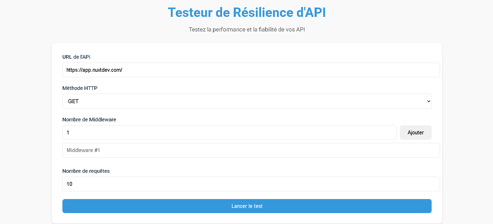
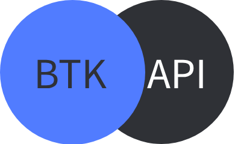

# TesteurDeResilienceD_Api

Un outil puissant pour tester la résilience et la performance des API RESTful. Cette application permet aux développeurs et aux testeurs de simuler des charges de requêtes multiples sur une API tout en fournissant des analyses détaillées des résultats et des erreurs potentielles.

🔗 [Accéder à l'application](https://app.nuxtdev.com/)

### Le Logo

## Fonctionnalités principales

### 1. Test de charge API
- Configuration flexible des requêtes HTTP (GET, POST, PUT, PATCH, DELETE)
- Possibilité d'envoyer plusieurs requêtes simultanées
- Support pour les corps de requête JSON
- Gestion des middlewares personnalisables
- Detection automatique de l'etat du système (Light ou Dark Mode).

### 2. Système de Proof of Work (PoW)
- Protection contre les attaques par déni de service
- Génération automatique de nonce et de hash
- Validation côté serveur des preuves de travail

### 3. Analyse statistique en temps réel
- Suivi du taux de réussite des requêtes
- Mesure des temps de réponse (minimum, maximum, moyenne)
- Catégorisation des erreurs (4xx, 5xx)
- Affichage détaillé des statistiques de performance

### 4. Analyse intelligente des erreurs avec IA
- Analyse détaillée des erreurs par une IA
- Suggestions de résolution personnalisées
- Identification des patterns d'erreurs
- Recommandations techniques basées sur le contexte

### 5. Interface utilisateur intuitive
- Design moderne et responsive
- Affichage en temps réel des résultats
- Navigation par onglets (Statistiques/Réponses)
- Visualisation claire des erreurs et des succès

### 6. Gestion avancée des erreurs
- Classification automatique des erreurs
- Suggestions de résolution contextuelles
- Détails techniques des erreurs
- Historique des réponses avec timestamps

## Installation et utilisation

1. Clonez le répertoire
2. Installez les dépendances avec `npm install`
3. Créez un fichier `.env` avec votre clé API OpenAI
4. Lancez le serveur de développement avec `npm start`

## Technologies utilisées

- React.js pour l'interface utilisateur
- Express.js pour le serveur backend
- OpenAI API pour l'analyse intelligente des erreurs
- Axios pour les requêtes HTTP
- Docker pour le déploiement

## Contribution

Les contributions sont les bienvenues ! N'hésitez pas à ouvrir une issue ou à soumettre une pull request.

## Licence

Ce projet est sous licence MIT.
